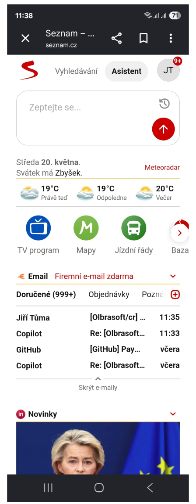
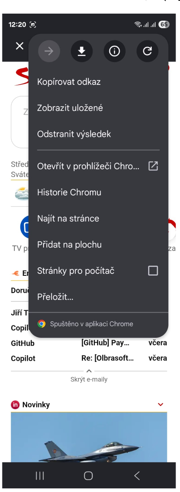
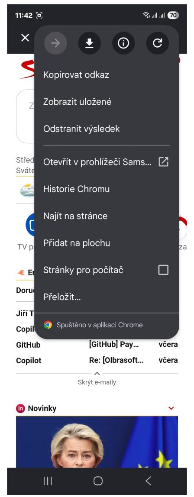
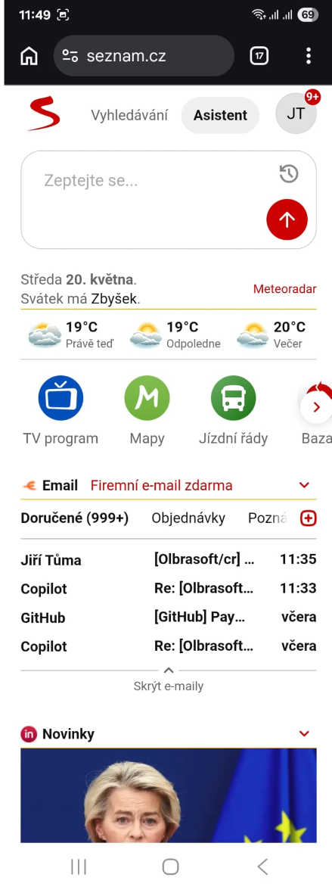
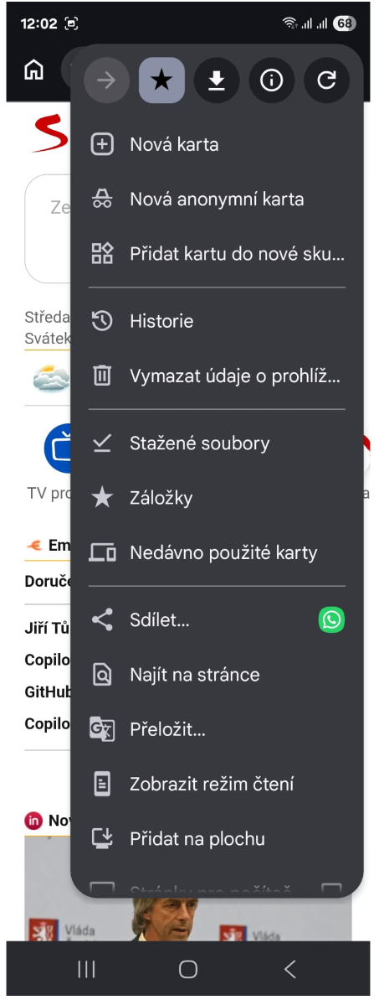
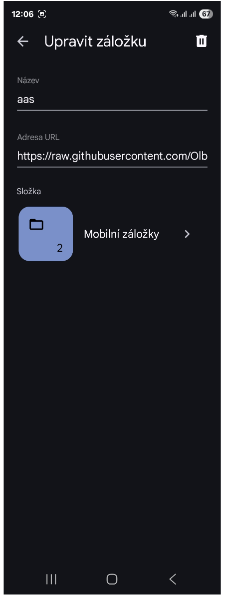
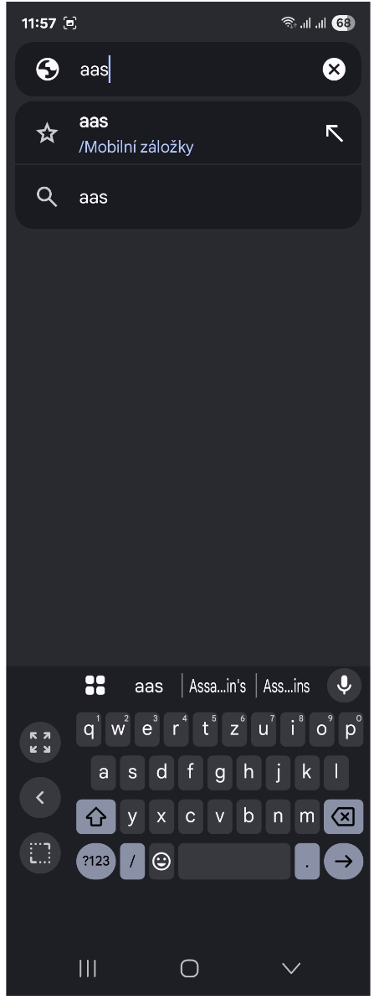
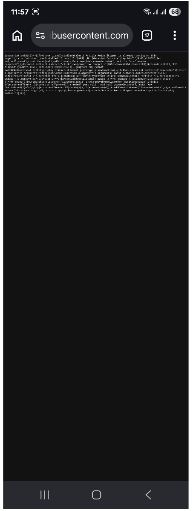

# Instalace na telefonu (Google Chrome / Android)

Podrobný návod, jak na telefonu s Androidem a aplikací Google Chrome zprovoznit
přeskakování reklam u TTS článků na Seznam rodině webů. Návod míří na uživatele,
kteří **nemají žádnou předchozí zkušenost s rozšířeními ani userscript managery** —
postačí umět tukat na obrazovku a kopírovat text.

> **Stručná verze pro spěchajícího:** Otevři Chrome (ne vyskakovací prohlížeč z
> Googlu) → zkopíruj **obsah** stránky [`bookmarklet/article-audio-skipper.bookmarklet.min.txt`](../bookmarklet/article-audio-skipper.bookmarklet.min.txt) → ulož libovolnou stránku jako záložku
> a přepiš jí **adresu URL** na ten zkopírovaný text → na článku napiš do adresního
> řádku `aas` → tukni návrh záložky → tukni Seznam play.

Pokud postupuješ podle obrázků dole, povede tě to za ruku.

---

## Proč zrovna bookmarklet?

Google Chrome stabilní verze na Androidu **nepodporuje rozšíření ani userscript
managery** (Tampermonkey apod.). Jediný způsob, jak v Chromu na Androidu rozjet
náš ad-skip skript, je tzv. **bookmarklet** — speciální záložka, jejíž adresa
URL místo „https://…" obsahuje samotný JavaScript kód, který se spustí v
kontextu právě otevřené stránky.

Tradeoff: zatímco na desktopu (rozšíření) nebo Firefox/Edge na Androidu
(userscript) skript běží automaticky, **bookmarklet musíš tuknout na každém
článku** předtím, než tukneš Seznam play. Je to ručních cca 3 tuky navíc.

---

## Předpoklady

- Telefon s Androidem.
- Nainstalovaný **Google Chrome** (z Obchodu Play; běžně bývá předinstalovaný).
- **Přihlášený Seznam účet** přímo v Chromu (důležité — bez přihlášení Seznam
  TTS endpoint vůbec nezavolá a není co modifikovat).

---

## Krok 1 — Otevřít opravdový Chrome (ne vyskakovací prohlížeč)

Tohle je **nejčastější kámen úrazu**: když napíšeš `seznam.cz` do vyhledávacího
políčka Google na úvodní obrazovce telefonu, Android ti stránku otevře v tzv.
**Chrome Custom Tab** uvnitř aplikace Google. Vypadá to skoro jako Chrome, ale
**není to plná aplikace Chrome**. V Custom Tab nemůžeš uložit funkční záložku
typu bookmarklet.

Jak Custom Tab poznáš:



- Vlevo nahoře je **„X" křížek** (ne šipka zpět).
- Titulek stránky „Seznam – ..." s drobnou doménou `seznam.cz` pod ním.
- Žádné ikony tabů ani plnohodnotné menu záložek.

### Nejrychlejší cesta ven: „Otevřít v prohlížeči Chrome"

Custom Tab má v menu (3 tečky vpravo nahoře) tlačítko, které tu samou stránku
**rovnou otevře v plné aplikaci Chrome** — to je nejjednodušší cesta, jak se z
toho vyskakovacího prohlížeče dostat do skutečného Chromu, aniž bys hledal/a
ikonu na ploše:

1. V Custom Tab tukni **tři tečky vpravo nahoře**.
2. V menu, které se otevře, najdi a tukni položku
   **„Otevřít v prohlížeči Chrome"** (s ikonou šipky se čtverečkem
   ↗ vpravo):

   

3. Tatáž stránka se otevře v samostatné aplikaci Chrome (na obrazovce se
   přepne nahoru lišta s adresním řádkem a ikona tabů — viz následující
   obrázek).

> **Když místo „Otevřít v prohlížeči Chrome" vidíš „Otevřít v prohlížeči
> Samsung..." nebo jiný název**, znamená to, že máš nastavený jiný prohlížeč
> než Chrome jako výchozí. Tato nabídka totiž otevře tvůj výchozí prohlížeč,
> ne nutně Chrome. Příklad, jak to vypadá při Samsung Internet jako výchozím:
>
> 
>
> Buď použij alternativní cestu níže (otevřít Chrome z ikony na ploše), nebo
> si nastav Chrome jako výchozí: **Nastavení** telefonu → lupa → napiš
> `výchozí` → **Výchozí aplikace** → **Aplikace prohlížeče** → vyber
> **Chrome**. Pak tu samou nabídku v Custom Tab uvidíš jako „Otevřít v
> prohlížeči Chrome" jako v prvním screenshotu výše.
>
> (V obou screenshotech si můžeš dole všimnout drobného nápisu **„Spuštěno
> v aplikaci Chrome"** — to potvrzuje, že Custom Tab uvnitř používá Chrome
> engine. **Bookmarklet ale v Custom Tab stejně nefunguje**, protože nemá
> přístup do uložených záložek plné aplikace Chrome.)

### Alternativa: otevřít Chrome ručně z plochy

Pokud z nějakého důvodu nechceš nebo nemůžeš použít cestu „Otevřít v
prohlížeči Chrome" (např. ji ti telefon vůbec nenabízí):

1. Stiskni domovské tlačítko (kruh dole uprostřed).
2. Najdi na ploše nebo v zásuvce aplikací **ikonu Chrome** (barevný kruh —
   červená/žlutá/zelená/modrá s bílým středem, pod ním nápis **Chrome**).
3. Tukni na ni a zadej adresu článku ručně.

Plný Chrome poznáš podle adresního řádku nahoře a ikony **tabů (čtvereček
s číslem)** vpravo od adresy:



---

## Krok 2 — Zkopírovat **obsah** bookmarkletu

V aplikaci Chrome:

1. Tukni do adresního řádku.
2. Napiš (nebo vlož) tuhle adresu:

   ```
   raw.githubusercontent.com/Olbrasoft/article-audio-skipper/main/bookmarklet/article-audio-skipper.bookmarklet.min.txt
   ```

3. Tukni klávesu **lupy / Enter**. Načte se prázdná-vypadající stránka s
   jedním dlouhým řádkem bílého textu, který začíná `javascript:void(...`.

> **Toto je nejdůležitější rozdíl:** Musíš zkopírovat **OBSAH STRÁNKY** (tj.
> ten text `javascript:void(...)`), **NIKOLI adresu samotné stránky**. To
> jsou dvě úplně různé věci a často se tady udělá chyba.

Postup, jak obsah správně označit:

1. **Dlouze podrž prst přímo na tom textu v těle stránky** (2–3 vteřiny).
   Pod prstem se objeví **modrý/oranžový výběr s úchyty** — výběr jednoho
   slova.
2. Z kontextového menu, které vyskočí, tukni **„Vybrat vše"**. Celý text
   na stránce by se měl označit (zmodří/zoranžoví).
3. Tukni **„Kopírovat"**.

Pokud se po dlouhém podržení nic neobjeví, zkus podržet déle a přesně na
nějaké písmeno toho textu — ne mezi řádky ani na okraji obrazovky.

---

## Krok 3 — Uložit záložku a vložit JavaScript do pole „Adresa URL"

Chrome na Androidu **neumí napsat `javascript:` přímo do adresního řádku** —
tento prefix v adresním řádku tiše vystřihne. Trik je: uložit nějakou
libovolnou stránku jako záložku, a pak jí **přepsat adresu URL** na ten
zkopírovaný JavaScript text.

### 3a — Uložit záložku

1. V Chromu klidně zůstaň na té raw.githubusercontent.com stránce (nebo
   přejdi na cokoli jiného — třeba google.com — je to jedno).
2. Tukni **tři tečky vpravo nahoře**:

   

3. Tukni **ikonu hvězdičky** v horní řadě ikon (přidat do záložek). Hvězdička
   změní barvu, na chvíli dole probleskne bublina „Záložka přidána".

### 3b — Editovat záložku a přepsat „Adresa URL"

> **POZOR! Pitfall, na který je dobré dát si pozor:**
>
> V editoru záložky uvidíš jen **dvě pole — „Název" a „Adresa URL"** a pak
> volbu složky. **Žádné samostatné pole „JavaScript / text" tam není.**
>
> Někoho — i autora tohohle návodu, viz konverzace nad ním 🙂 — napadne, že
> by „URL" zůstala ta původní github adresa a „text bookmarkletu" by patřil
> do nějakého samostatného pole. **Není to tak.** Celý `javascript:void(...)`
> kód musí jít **přímo do pole „Adresa URL"**, kde normálně bývá `https://…`.
> Tam se ten kód ukládá jako adresa.

Postup:

1. Otevři editor záložky: **tři tečky** → **Záložky** → **Mobilní záložky** →
   najdi tu právě uloženou → tukni **tři tečky vedle ní** → **Upravit**.
2. V poli **„Název"** smaž současný obsah a napiš krátké **`aas`** (kvůli
   pohodlnému autocomplete v adresním řádku).
3. Tukni do pole **„Adresa URL"**. Bude tam URL té stránky, na které jsi byl/a
   při ukládání (např. `https://raw.githubusercontent.com/...` nebo
   `https://www.google.com/`). **Toto NENÍ to, co tam chceš:**

   

4. **Vymaž celý obsah URL pole.** Dlouze podrž v něm prst → **„Vybrat vše"** →
   tukni klávesu **smazat (X / backspace)**. Pole musí být **úplně prázdné**.
5. **Dlouze podrž prst v prázdném URL poli** → vyskočí kontextové menu →
   tukni **„Vložit"**. Vloží se ten dlouhý `javascript:void(...)` text.
6. **Podívej se očima, že pole začíná přesně `javascript:void(`**:

   

   Text je dlouhý cca 1400 znaků, takže ho neuvidíš celý — to je v pořádku,
   stačí ověřit ten začátek. Pokud místo `javascript:void(` vidíš `https://`,
   krok 2 (kopírování obsahu) se nepovedl — vrať se a kopíruj znova,
   **z těla stránky**, ne z adresního řádku.
7. Tukni **šipku zpět** vlevo nahoře. Záložka se uloží.

---

## Krok 4 — Spuštění na článku

1. V Chromu otevři článek na **novinky.cz** nebo **seznamzpravy.cz**, který
   má vedle nadpisu **ikonu „přečíst nahlas"** (reproduktor s vlnkami).
2. Tukni do adresního řádku a napiš **`aas`**. V seznamu návrhů uvidíš svou
   záložku — ikona hvězdičky vlevo + nápis **`aas /Mobilní záložky`**:

   

3. **Tukni přímo na ten návrh záložky** (ne klávesu Enter, ne návrh s ikonou
   lupy — to by byl jen Google search).
4. **Měl by vyskočit dialog** s textem:

   > Article Audio Skipper armed — tap the Seznam play button.

   Tukni **OK**.
5. Tukni originální **Seznam play tlačítko** u nadpisu článku.
6. Reklamy (preroll, mid-roll, post-roll) se ztiší a přeskočí během cca
   jedné vteřiny. Měl bys/měla rovnou slyšet hlas článku.

---

## Co se může pokazit

### „Tukl jsem na záložku a Chrome mě jen přesměroval na nějaký dlouhý text"



Záložka **má v poli „Adresa URL" pořád původní adresu** (typicky
`https://raw.githubusercontent.com/...`), ne ten `javascript:void(...)`
text. Vrať se na **Krok 3b** a opravdu URL pole přepiš.

Nejčastější příčiny:

- **Před vložením jsi nesmazal/a původní text** v URL poli — vložení se
  zařadilo na začátek nebo doprostřed původní URL a celé to pak Chrome
  nepoznal jako platnou adresu, takže nechal původní.
- **Schránka neobsahovala JavaScript**, ale URL — typicky když jsi v
  Kroku 2 místo dlouhého podržení na **obsahu stránky** kopíroval/a z
  adresního řádku (např. „Sdílet → Kopírovat odkaz"). Vrať se a kopíruj
  obsah, ne adresu.

### „Tukl jsem na záložku, vyskočil popup armed, ale po tuknutí play je pořád slyšet reklama"

Tukl/a jsi Seznam play **ještě před** tím, než jsi tukl/a záložku, nebo
jsi tuknul/a záložku až po prvním přehrávaném videu. Bookmarklet musí být
nainstalovaný **dříve**, než Seznam pustí první ad. Postup:

1. Stáhni stránku dolů → refresh (potáhni odshora dolů).
2. Adresní řádek → `aas` → tukni návrh → OK na popup.
3. **Pak teprve** tukni Seznam play.

### „Vyskakuje mi popup, že už běží na téhle stránce"

```
Article Audio Skipper is already running on this page.
```

To znamená, že jsi záložku tukl/a dvakrát po sobě na stejné stránce. Nic
zlého — tukni OK, dál se nic neděje, hook už je nainstalovaný z prvního
tuknutí. Stačí pokračovat ve čtení článku.

### „Žádný popup nevyskočí — jako kdyby se neudálo nic"

Možnost A — **návrh záložky jsi přehlédl/a a tukl/a obecný Google search**.
Vrať se do adresního řádku, napiš `aas` znova a podívej se přesně, jakou
ikonu má návrh: hvězdička = záložka (správně), lupa „G" = Google search
(špatně).

Možnost B — **Chrome verzi se zatím nepodařilo přesně reprodukovat, ale**
**na některých verzích Chrome Android tichá filtrace `javascript:`** v
URL při ukládání záložky byla dříve pozorována. Když ti popup po správně
připravené záložce **opakovaně nevyskakuje**, je čas přejít na alternativu:

- **Nainstaluj Firefox** z Obchodu Play.
- V něm nainstaluj rozšíření **Tampermonkey** (z addons.mozilla.org).
- Otevři `https://raw.githubusercontent.com/Olbrasoft/article-audio-skipper/main/userscript/article-audio-skipper.user.js`
  — Tampermonkey nabídne instalaci.
- Hotovo — Firefox + userscript běží **plně automaticky** bez tukání
  záložky na každém článku.

To je dlouhodobě pohodlnější řešení, jen vyžaduje použít Firefox místo
Chromu.

---

## Každodenní použití (až máš všechno nainstalované)

| Akce | Frekvence |
|------|-----------|
| Otevřít Chrome (z ikony, ne z Google search widgetu) | Pokaždé |
| Přejít na článek (`novinky.cz`, `seznamzpravy.cz`, …) | Pokaždé |
| Adresní řádek → `aas` → tukni návrh → OK | **Na každém článku** |
| Tuknout Seznam play | Pokaždé |
| (Zkopírovat text, uložit záložku, přihlásit Seznam účet) | Jednou na začátku |

To je všechno. Cca 3 tuky navíc proti normálnímu poslechu, jako odměna —
žádné cca 50 vteřin reklam před článkem a žádné reklamy uprostřed/po něm.

---

## Často kladené otázky

**Můžu mít na stejném telefonu i Firefox s userscriptem a v Chromu bookmarklet?**

Ano. Ale na **jedné konkrétní záložce/článku** spouštěj jen jednu z nich —
když poběží oba zároveň (nestane se přepnutím prohlížeče, ale teoreticky),
hook by se nainstaloval dvakrát a logy by se duplikovaly.

**Funguje to i bez přihlášení na Seznam?**

Ne. Bez přihlášení Seznam TTS endpoint vůbec nezavolá → nevznikne `<video>`
element → bookmarklet nemá co hookovat. Přihlas se v Chromu na `seznam.cz`.

**Co když Seznam změní HTML strukturu TTS tlačítka?**

Bookmarklet hledá selektor `[data-dot="atm-tts-play-btn"]`. Pokud ho Seznam
přejmenuje, přestane fungovat — v repu pak najdeš opravu a stáhneš si znova
text bookmarkletu z `bookmarklet/article-audio-skipper.bookmarklet.min.txt`.

**Můžu si stáhnout MP3 audio článku?**

V současné verzi ne — bookmarklet jen přeskakuje reklamy. Skip extension
distribuce (desktop) sice logovala URL MP3 souboru do konzole, ale
bookmarklet pro úspory velikosti tuhle diagnostiku vynechává.
